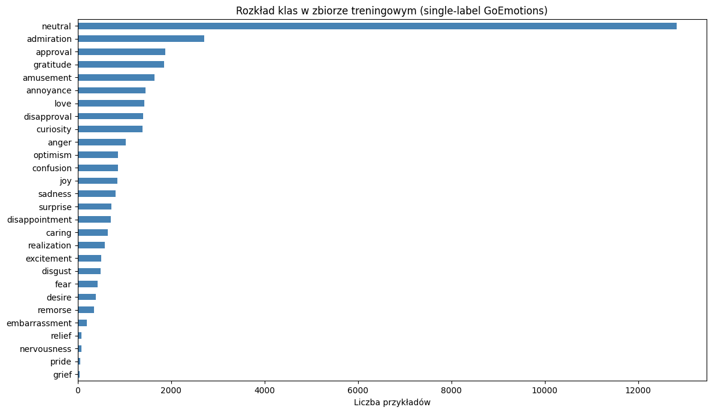
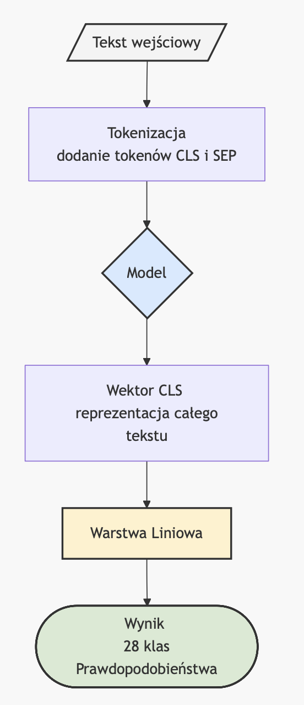
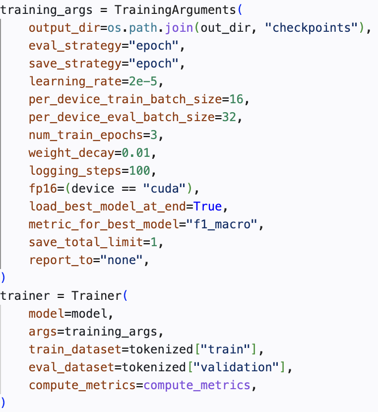
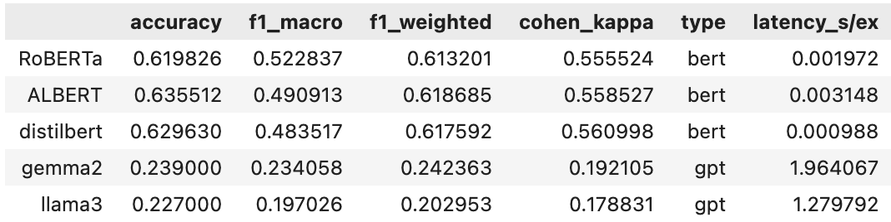
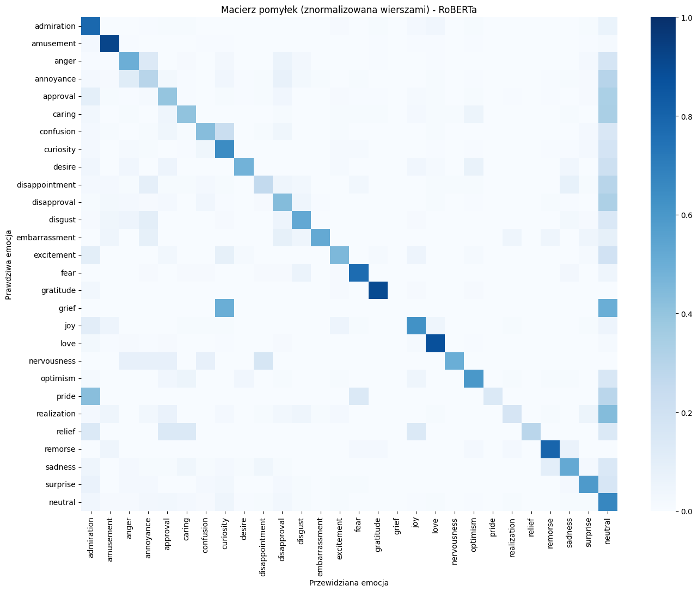
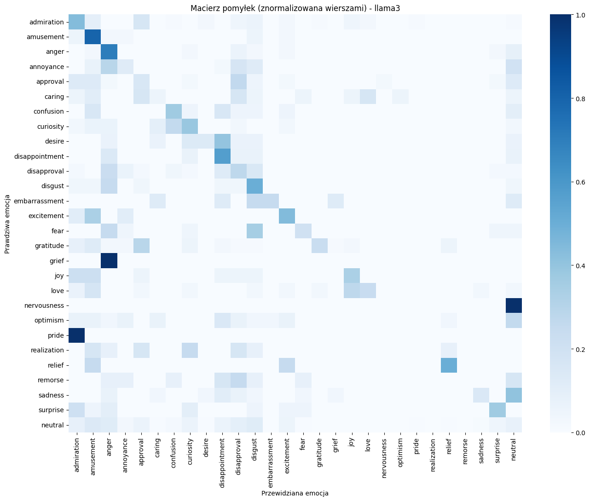
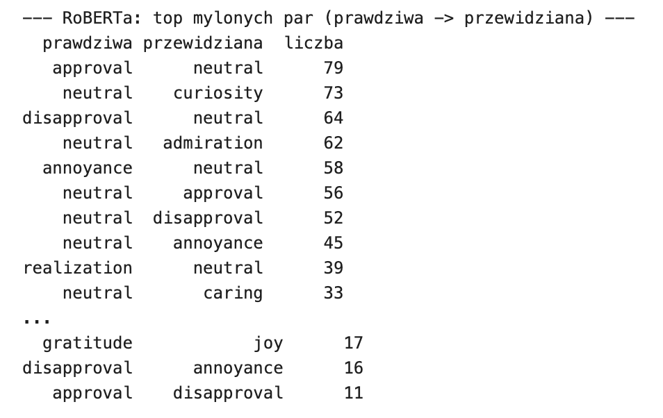

# Sprawozdanie: Emocjonalna mapa języka — analiza emocji w tekstach kultury

## 1. Opis problemu i celu projektu

Rozpoznawanie emocji w tekstach stanowi jedno z kluczowych, a zarazem najtrudniejszych zagadnień we współczesnym Przetwarzaniu Języka Naturalnego. W odróżnieniu od klasycznej analizy sentymentu ograniczającej się do klasyfikacji tekstu w trzech wymiarach - pozytywny, negatywny, neutralny - analiza emocji wymaga od modeli sztucznych sieci neuronowych zrozumienia znacznie bardziej złożonych niuansów semantycznych. Ich celem jest identyfikacja konkretnych, zróżnicowanych stanów psychologicznych, takich jak np. radość, smutek, złość, strach, podziw.

Głównym celem niniejszego projektu jest przeprowadzenie analizy emocji w wypowiedziach poprzez wytrenowanie oraz zastosowanie zaawansowanych modeli sztucznych sieci neuronowych, a następnie wyznaczenie na tej podstawie emocjonalnej mapy języka. Oznacza to zbadanie rozkładu i dominacji poszczególnych stanów emocjonalnych w wykorzystanym tekście oraz określenie, z jaką precyzją nowoczesne architektury NLP potrafią te stany mapować.

Problem badawczy został sformułowany jako zadanie wieloklasowej klasyfikacji tekstu. Z punktu widzenia technicznego i architektonicznego, projekt zakłada realizację tego zadania dwutorowo, co pozwala na spojrzenie na możliwości współczesnych sztucznych sieci neuronowych:

1. Podejście nadzorowane z wykorzystaniem modeli opartych na architekturze Enkodera z rodziny BERT (konkretnie: RoBERTa, DeBERTa, ALBERT). Podejście to wymaga dostosowania wag wytrenowanych językowo modeli na odpowiednio przygotowanym, specyficznym zbiorze uczącym, co pozwala modelom na wyuczenie się charakterystyki 28 zdefiniowanych klas emocjonalnych.
2. Podejście nienadzorowane z wykorzystaniem generatywnych, dużych modeli językowych (LLM) w architekturze Dekodera. Celem tego podejścia jest zbadanie wrodzonych zdolności modeli generatywnych do rozpoznawania i etykietowania emocji wyłącznie na podstawie inżynierii podpowiedzi, bez kosztownego procesu douczania. Ze względu na narzut obliczeniowy, ta metoda została zaaplikowana do reprezentatywnej podpróbki danych.

Realizacja tak postawionego celu i ewaluacja problemu wymagają zmierzenia się z typowym dla rzeczywistych danych tekstowych zjawiskiem znaczącego niezbalansowania klas - silnej dominacji tekstów o charakterze neutralnym. Weryfikacja skuteczności modeli będzie opierać się nie tylko na globalnych metrykach, ale przede wszystkim na metrykach uwzględniających mniejszościowe klasy emocji, a także na analizie macierzy pomyłek i badaniu tekstów błędnie zaklasyfikowanych.

---

## 2. Opis wykorzystanego zbioru danych

W projekcie wykorzystano zbiór danych GoEmotions udostępniony przez Google Research (w konfiguracji `simplified`). Jest to zbiór anglojęzycznych komentarzy pochodzących z platformy Reddit, które zostały ręcznie wyetykietowane pod kątem występowania w nich różnych emocji.

Oryginalnie zbiór ten jest zbiorem wieloetykietowym, co oznacza, że jeden tekst może wyrażać kilka emocji jednocześnie. W celu uproszczenia zadania klasyfikacji i sprowadzenia go do standardowego problemu jednoetykietowego, zbiór został poddany wstępnej filtracji. Z danych odrzucono wszystkie przykłady posiadające więcej niż jedną przypisaną emocję, a jedyną pozostawioną etykietę wyodrębniono jako docelową zmienną objaśnianą.

Po zastosowaniu filtru wykluczającego teksty o wielu etykietach, rozmiary poszczególnych podzbiorów ukształtowały się następująco:
* Zbiór treningowy: 36 308 przykładów
* Zbiór walidacyjny: 4 548 przykładów
* Zbiór testowy: 4 590 przykładów

Zbiór zawiera 28 unikalnych klas, na które składa się 27 zdefiniowanych stanów emocjonalnych (np. *admiration*, *amusement*, *anger*, *joy*) oraz jedna klasa *neutral* oznaczająca brak wyraźnego nacechowania emocjonalnego. 

Istotną cechą i zarazem głównym wyzwaniem związanym z wybranym zbiorem danych jest jego bardzo silne niezbalansowanie klas. Analiza rozkładu klas w zbiorze treningowym wykazuje dominację etykiety neutral, która liczy 12 823 przykładów. Kolejne najczęściej występujące emocje to admiration (2 710 przykładów) oraz approval (1 873 przykłady). Z kolei najmniej liczne klasy to pride (51 przykładów), takze grief (39 przykładów). 

Ta dysproporcja pomiędzy poszczególnymi klasami miała bezpośrednie przełożenie na proces uczenia i konieczność doboru metryk ewaluacji. Zjawisko to pokazuje również potencjalne pole do ulepszenia modeli w przyszłości np. poprzez usunięcie klasy neutral z procesu klasyfikacji, aby model skupił się wyłącznie na analizie konkretnych uczuć.

<figure>
  
  <figcaption>
Wykres 1 Rozkład klas w zbiorze treningowym.
</figcaption>
</figure>

---

## 3. Opis zastosowanej architektury sieci neuronowej

W projekcie wykorzystano architekturę opartą na transformatorach, która stanowi obecnie standard w zadaniach Przetwarzania Języka Naturalnego. Aby zrealizować postawiony cel i porównać różne podejścia do analizy emocji, zastosowano dwie odrębne rodziny modeli: modele oparte na enkoderze (rodzina BERT) oraz modele oparte na dekoderze (rodzina GPT). 

### 3.1. Modele z rodziny BERT (Architektura Enkodera)
Modele tego typu przetwarzają tekst dwukierunkowo, co pozwala im na głębokie zrozumienie kontekstu całego zdania. W projekcie zaimplementowano trzy warianty z tej rodziny:
1. RoBERTa (Robustly Optimized BERT Approach) – zoptymalizowana wersja BERT-a, trenowana dłużej, na większym korpusie danych i z użyciem dynamicznego maskowania tokenów, co pozwoliło na uzyskanie najwyższego zbalansowanego wskaźnika Macro-F1.
2. ALBERT (A Lite BERT) – odchudzona architektura projektowa wykorzystująca techniki współdzielenia parametrów między warstwami oraz faktoryzację osadzeń tokenów. Zredukowana liczba parametrów nie wpłynęła negatywnie na jakość – model ten osiągnął najwyższą ogólną dokładność (Accuracy) w zestawieniu.
3. DistilBERT – wersja BERT-a wykorzystująca proces destylacji wiedzy. Posiada znacznie mniej parametrów, przez co charakteryzuje się najniższym czasem wnioskowania przy zachowaniu wysokiej skuteczności.

Architektura każdego z tych modeli została rozbudowana o dedykowaną głowę klasyfikacyjną. Polega to na pobraniu wektora osadzeń z tokena `[CLS]` (reprezentującego całą sekwencję tekstu) i przepuszczeniu go przez w pełni połączoną warstwę liniową, a następnie przez funkcję aktywacji, która mapuje wynik na 28 rozkładów prawdopodobieństwa dla poszczególnych emocji.

<figure>
  

  <figcaption>
Rysunek 1 Schemat architektury klasyfikacji za pomocą modelu typu BERT.
</figcaption>
</figure>

### 3.2. Modele Generatywne GPT (Architektura Dekodera)
Jako rozszerzenie eksperymentu wykorzystano dwa duze modele językowe z rodziny GPT. W odróżnieniu od BERTów, modele te przetwarzają tekst jednokierunkowo i służą do generowania odpowiedzi na podstawie zadanego kontekstu - promptu.

Zastosowane modele charakteryzują się ogromną liczbą parametrów. Aby umożliwić ich uruchomienie w dostępnym środowisku wykonawczym (ograniczona pamięć VRAM), zastosowano kwantyzację 4-bitową. Jest to technika kompresji modelu, która zmniejsza precyzję wag sieci z 16 lub 32 bitów do 4 bitów, drastycznie redukując zapotrzebowanie na pamięć bez krytycznej utraty zdolności logicznych modelu.

---

## 4. Opis procesu uczenia

Proces pozyskiwania gotowych systemów do analizy emocji w tym projekcie przebiegał zupełnie inaczej dla modeli BERT i GPT, co wynika z przyjętej metodologii.

### 4.1. Fine-tuning modeli z rodziny BERT
Modele enkoderowe zostały poddane procesowi douczania z nadzorem na docelowym zbiorze danych GoEmotions. Jako funkcję straty dla wieloklasowej klasyfikacji jednoetykietowej zastosowano Entropię Krzyżową. Algorytmem optymalizującym wagi był standardowy w środowisku NLP i domyślny dla biblioteki Transformers wariant optymalizatora Adam, uwzględniający zanikanie wag.

Ze względu na wysoką złożoność obliczeniową procesu treningowego na dużej próbie tekstów i niestabilność środowiska, proces uczenia nie odbył się w jednym nieprzerwanym ciągu. Zastosowano mechanizm punktów kontrolnych. Modele były trenowane w mniejszych, odrębnych sesjach, a postępy wag były zapisywane na dysku. Po wymuszonym przerwaniu sesji trening był wznawiany od ostatniego zapisanego punktu, natomiast w przypadku ewaluacji końcowej wczytywano najlepsze zapisane wagi do obliczenia metryk na zbiorze testowym. Pozwoliło to zminimalizować ryzyko utraty postępów.

### 4.2. Wnioskowanie Zero-Shot dla modeli GPT
Dwa wykorzystane modele generatywne (GPT) nie były poddawane żadnemu procesowi uczenia. Ich implementacja opierała się na podejściu Zero-shot. Oznacza to, że modele otrzymały wyłącznie sformatowane zapytanie wejściowe, w którym zdefiniowano zadanie klasyfikacji tekstu do jednej z 28 dostępnych klas.

Przeprowadzenie pełnej ewaluacji modeli GPT na całym zbiorze testowym było niemożliwe ze względów wydajnościowych. Pomimo zastosowania kwantyzacji 4-bitowej, czas generacji odpowiedzi przez modele w architekturze dekodera był zbyt długi. W związku z tym podjęto decyzję o ograniczeniu zbioru testowego dla modeli GPT wyłącznie do próbki pierwszych 1000 tekstów.

<figure>
  

  <figcaption>
Rysunek 2 Lista hiperparametrów dla modeli BERT.
</figcaption>
</figure>

---

## 5. Opis zastosowanych metryk ewaluacji

Wybór odpowiednich metryk ewaluacji ma kluczowe znaczenie dla rzetelnej oceny zdolności predykcyjnych modeli, szczególnie w obliczu skrajnego niezbalansowania klas. Ocena systemów klasyfikacyjnych opierająca się wyłącznie na jednej globalnej mierze mogłaby prowadzić do błędnych, zbyt optymistycznych wniosków. W związku z tym w projekcie zastosowano zestaw zróżnicowanych metryk matematycznych oraz narzędzi wizualnych.

### 5.1. Dokładność (Accuracy)
Dokładność to najbardziej intuicyjna metryka, zdefiniowana jako stosunek liczby poprawnych predykcji do wszystkich przykładów w zbiorze testowym:

$$\text{Accuracy} = \frac{TP + TN}{TP + TN + FP + FN} = \frac{\text{Liczba poprawnych predykcji}}{\text{Wszystkie przykłady}}$$

W przypadku analizowanego zbioru GoEmotions, gdzie klasa neutral stanowi ponad 35% danych, metryka ta jest mało miarodajna. Model, który klasyfikowałby każdy tekst jako neutral, osiągnąłby wysoką dokładność bazową, nie ucząc się zarazem rozpoznawania żadnej z właściwych emocji. Dlatego potraktowano ją jedynie jako metrykę pomocniczą.

### 5.2. Precyzja (Precision) i Czułość (Recall)
Dla każdej z 28 klas metryki te obliczane są indywidualnie, stanowiąc bazę pod bardziej zaawansowane wskaźniki:
* Precyzja (Precision): Określa, jaka część tekstów wskazanych przez model jako dana emocja faktycznie do niej należy. Chroni przed błędami typu False Positive.
$$\text{Precision} = \frac{TP}{TP + FP}$$

* Czułość (Recall): Określa, jaką część wszystkich rzeczywistych przykładów danej emocji model był w stanie poprawnie wykryć. Chroni przed błędami typu False Negative.
$$\text{Recall} = \frac{TP}{TP + FN}$$

### 5.3. Miara F1 (F1-Score) i jej wariant Macro
Miara F1 jest średnią harmoniczną precyzji i czułości. Pozwala na jednoczesne balansowanie obu tych wartości:

$$\text{F1-Score} = 2 \cdot \frac{\text{Precision} \cdot \text{Recall}}{\text{Precision} + \text{Recall}}$$

W zadaniach wieloklasowych kluczowy jest sposób agregacji tego wskaźnika. W projekcie jako kluczową metrykę porównawczą wybrano Macro-F1 Score.

Metoda Macro oblicza miarę F1 niezależnie dla każdej z 28 klas, a następnie wyciąga z nich zwykłą średnią arytmetyczną:

$$\text{Macro-F1} = \frac{1}{N} \sum_{i=1}^{N} \text{F1-Score}_i$$

*gdzie $N = 28$ - liczba klas.*

Wariant Macro traktuje każdą klasę - emocję - z dokładnie taką samą wagą. Niezależnie od tego, czy klasa liczy tysiące przykładów, czy zaledwie kilkadziesiąt, jej wpływ na ostateczny wynik wynosi $\frac{1}{28}$. Dzięki temu niska skuteczność na klasach mniejszościowych drastycznie obniża wynik końcowy, co idealnie pokazuje rzeczywistą jakość działania sieci neuronowej.

### 5.4. Macierz Pomyłek (Confusion Matrix)
Macierz pomyłek to dwuwymiarowa tabela o wymiarach $28 \times 28$, w której osie reprezentują klasy rzeczywiste oraz klasy przewidziane przez model. 

Jest to najważniejsze narzędzie diagnostyczne w projekcie, pozwalające na wizualną identyfikację, które emocje są ze sobą najczęściej mylone przez sieć, a takze w jakim stopniu dominująca klasa neutral przyciąga predykcje z innych, rzadszych klas emocjonalnych.

<figure>
  

  <figcaption>
Rysunek 3 Tabela metryk ewaluacji uzytych modeli.
</figcaption>
</figure>

---

## 6. Przedstawienie i omówienie wyników

W tej sekcji przedstawiono szczegółowe wyniki projektu dla wszystkich pięciu badanych modeli. Analiza została podzielona na zestawienie globalnych metryk skuteczności, badanie wydajności obliczeniowej, analizę metryk pomocniczych oraz ewaluację poszczególnych błędów za pomocą macierzy pomyłek.

### 6.1. Główne wyniki klasyfikacji (Accuracy i Macro-F1)

Ewaluacja modeli w zadaniu klasyfikacji do 28 etykiet ukazała bardzo wyraźną przewagę modeli z rodziny BERT, które zostały poddane procesowi fine-tuningu.

| Model | Rodzina | Dokładność (Accuracy) | Macro-F1 | Wskaźnik Cohena (Kappa) |
| :--- | :---: | :---: | :---: | :---: |
| **RoBERTa** | BERT | 0.6198 | **0.5228** | 0.5555 |
| **ALBERT** | BERT | **0.6355** | 0.4909 | 0.5585 |
| **DistilBERT** | BERT | 0.6296 | 0.4835 | **0.5609** |
| **Gemma 2** (4-bit) | GPT | 0.2390 | 0.2341 | 0.1921 |
| **Llama 3** (4-bit) | GPT | 0.2270 | 0.1970 | 0.1788 |

*Tabela 1 Zestawienie głównych metryk skuteczności dla wszystkich modeli.*

Najwyższą wartość kluczowej dla tego projektu metryki Macro-F1 - (0.5228) - osiągnął model RoBERTa. To jednak model ALBERT osiągnął nieznacznie wyższą dokładność ogólną (Accuracy: 0.6355), jednak odbyło się to kosztem niższej skuteczności na klasach mniejszościowych. Wynika to bezpośrednio z własności wykorzystanego zbioru danych – ALBERT częściej i bezpieczniej przewidywał klasę dominującą, co sztucznie zawyżyło jego dokładność kosztem zbalansowanej precyzji.

Modele generatywne poradziły sobie z tym zadaniem dosyć słabo (Macro-F1 poniżej 0.24). Rozpoznawanie 28 subtelnych stanów emocjonalnych bez uprzedniego douczania okazało się zadaniem zbyt trudnym dla duzych modeli językowych w architekturze dekodera.

### 6.2. Wydajność obliczeniowa (Czas inferencji)

Analizując praktyczny potencjał wdrożeniowy przetestowanych modeli, konieczne jest zwrócenie uwagi na czas wnioskowania. 

| Model | Czas wnioskowania (s / tekst) | Rząd wielkości (względem najszybszego) |
| :--- | :---: | :---: |
| **DistilBERT** | **0.00099 s** | 1x (Najszybszy) |
| **RoBERTa** | 0.00197 s | ~2x wolniejszy |
| **ALBERT** | 0.00315 s | ~3x wolniejszy |
| **Llama 3** | 1.27979 s | ~1 300x wolniejszy |
| **Gemma 2** | 1.96407 s | ~2 000x wolniejszy |

*Tabela 2 Zestawienie czasu inferencji (sekundy na jeden przykład).*

Zestawienie to dyskwalifikuje zastosowane modele GPT w obecnej konfiguracji i środowisku sprzętowym z analizy w czasie rzeczywistym.

### 6.3. Analiza metryk pomocniczych: Top-3 oraz redukcja do wymiaru Sentymentu

Aby pogłębić analizę wyników dla najskuteczniejszej rodziny modeli (BERT), wprowadzono metrykę Top-3 Accuracy. Mierzy ona odsetek przypadków, w których rzeczywista emocja znalazła się w trójce najbardziej prawdopodobnych predykcji sieci. Ponadto dokonano projekcji 28 klas na 4 podstawowe makro-kategorie sentymentu (Pozytywny, Negatywny, Neutralny, Niejednoznaczny).

| Model | Dokładność Top-3 | Dokładność (Sentyment) | Macro-F1 (Sentyment) |
| :--- | :---: | :---: | :---: |
| **RoBERTa** | **0.8695** (86.95%) | 0.7198 | 0.6919 |
| **ALBERT** | 0.8632 (86.32%) | 0.7220 | 0.6899 |
| **DistilBERT** | 0.8595 (85.95%) | **0.7242** | **0.6953** |

*Tabela 3. Wyniki zaawansowane dla modeli z rodziny BERT*

Modele z rodziny BERT wykazują bardzo dobrą skuteczność Top-3 na poziomie ~87%. Oznacza to, że nawet w przypadku błędnej klasyfikacji głównej, sieć niemal zawsze rozumie ogólny wydźwięk tekstu i poprawnie zawęża obszar poszukiwań do pokrewnych stanów emocjonalnych. Po zredukowaniu złożoności problemu do wymiaru sentymentu, skuteczność modeli rośnie do ponad 72%. 

### 6.4. Analiza Macierzy Pomyłek i błędnych klasyfikacji

Kluczowym elementem diagnostycznym projektu jest analiza rozkładu błędów. Z powodu bardzo silnego niezbalansowania danych treningowych, model wykształcił wyraźną tendencję, by w przypadku niepewności klasyfikować tekst jako neutral.

<figure>
  

  <figcaption>
Rysunek 4 Macierz pomyłek modelu RoBERTa
</figcaption>
</figure>

<figure>
  

  <figcaption>
Rysunek 5 Macierz pomyłek modelu Llama3
</figcaption>
</figure>

Obserwując macierz pomyłek, można zauważyć wyraźny, pionowy pas ciemniejszego koloru dla przewidywanej etykiety neutral. Emocje słabiej reprezentowane w zbiorze były systematycznie ignorowane przez model i wchłaniane przez klasę dominującą.

Analiza logów ujawniła, że sieci neuronowe miały problemy nie tylko z neutralnością, ale także z precyzyjnym rozróżnieniem bliskoznacznych stanów psychologicznych. Najczęstsze pomyłki występowały między następującymi parami:
* Anger a Annoyance - model często uznawał wyraźną złość jedynie za irytację.
* Grief a Confusion.
* Pride a Admiration.

<figure>
  

  <figcaption>
Rysunek 6 Zestawienie najczęściej mylonych par emocji przez model RoBERTa.
</figcaption>
</figure>

---

## 7. Wnioski końcowe

Przeprowadzony eksperyment badawczy pozwolił na szczegółową analizę problemu rozpoznawania emocji w tekstach oraz na bezpośrednie porównanie diametralnie różnych architektur sztucznych sieci neuronowych. Na podstawie uzyskanych wyników i analizy błędów sformułowano następujące wnioski:

1. Przewaga dedykowanego Fine-tuningu nad trybem Zero-shot:
   Projekt pokazał, że w zadaniu wieloklasowej klasyfikacji emocji, mniejsze modele enkoderowe (rodzina BERT) poddane procesowi douczania z nadzorem radzą sobie znacznie lepiej niż modele generatywne (LLM) działające w trybie zero-shot. Wytrenowany model RoBERTa osiągnął ponad dwukrotnie wyższy wynik Macro-F1 niż modele Llama 3 czy Gemma 2. Oznacza to, że transfer wiedzy na konkretną domenę i strukturę etykiet jest kluczowy dla precyzyjnego rozpoznawania cech tekstu.

2. Wydajność i zastosowanie praktyczne:
   Zastosowanie modeli dekoderowych o dużej liczbie parametrów pomimo uzycia kwantyzacji 4-bitowej w zadaniach masowej klasyfikacji tekstów jest nieefektywne obliczeniowo. Model DistilBERT, będący najlżejszą zastosowaną architekturą, osiągnął bardzo dobre wyniki klasyfikacyjne, będąc przy tym tysiące razy szybszym w inferencji od modeli GPT. Czyni go to najbardziej optymalnym wyborem do wdrożeń w systemach analizujących dane w czasie rzeczywistym.

3. Wpływ dominacji klasy neutral:
   Największym zidentyfikowanym wyzwaniem w projekcie był silny brak balansu w zbiorze danych, ze szczególnym uwzględnieniem dominacji klasy neutral - ponad 35% zbioru treningowego. Spowodowało to zjawisko wybierania przez modele najbezpieczniejszej predykcji. Gdy sieć napotykała tekst z subtelnie zarysowaną emocją, wolała sklasyfikować go jako neutralny, aby zminimalizować błąd.

4. Ogólne zrozumieniu sentymentu (Top-3 Accuracy):
   Mimo trudności z precyzyjnym wskazaniem jednej z 28 bardzo podobnych emocji, badane modele z rodziny BERT wykazały bardzo dobre zrozumienie szerszego kontekstu wypowiedzi. Wskazuje na to wysoka trafność Top-3 (ok. 87%) oraz wyniki przy mapowaniu klas na 4 podstawowe wskaźniki sentymentu. Sieci te rzadko mylą emocje o skrajnie różnej polaryzacji, a ich pomyłki zachodzą głównie w obrębie bliskich klastrów semantycznych.

